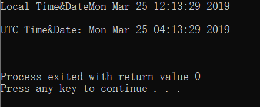

* C++

```c++
#include <iostream>
#include <ctime>

using namespace std;

int main( )
{
   // 基于当前系统的当前日期/时间
   time_t now = time(0);

   // 把 now 转换为字符串形式
   char* dt = ctime(&now);

   cout << "本地日期和时间：" << dt << endl;

   // 把 now 转换为 tm 结构
   tm *gmtm = gmtime(&now);
   dt = asctime(gmtm);
   cout << "UTC日期和时间："<< dt << endl;
}
```




* Java

```

```

* Python

```

```

* Haskell

```

```

* 汇编

```

```

* 其他


```
  待补充


```
